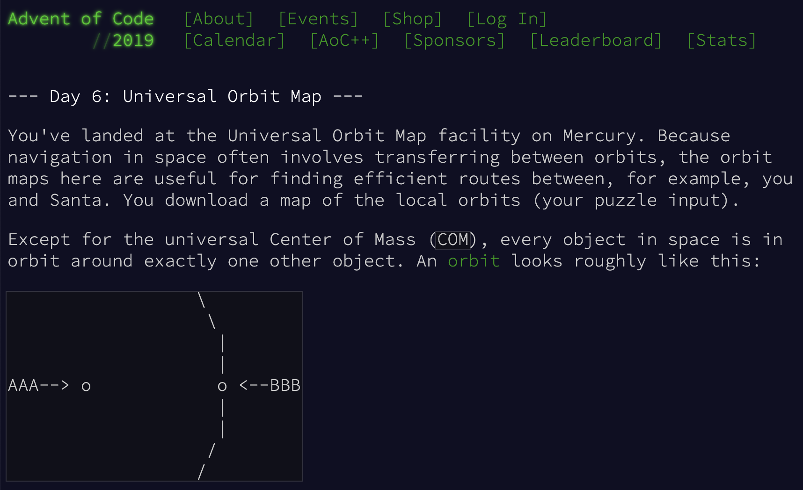

# Advent Of Code 2019
[Advent of Code](https://adventofcode.com/2019) is an Advent calendar of small programming puzzles for a variety of skill sets and skill levels that can be solved in the programming language of our choice. People use them as a speed contest, interview prep, company training, university coursework, practice problems, or to challenge each other. 

The way advent of code works is just like your regular advent calendar, every day there will be a new puzzle to solve. So in December of 2019, we made a private leaderboard with Codam students to challenge each other to learn new things every day.

